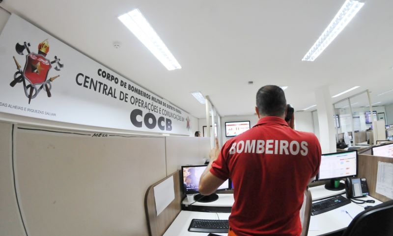

# Apresentação

Com o objetivo de otimizar o atendimento a emergências no Distrito Federal, foi estabelecido um Protocolo Integrado envolvendo o [Corpo de Bombeiros Militar do Distrito Federal](https://www.cbm.df.gov.br/) (CBMDF), a [Polícia Militar do Distrito Federal](https://www.pmdf.df.gov.br/) (PMDF) e o [Serviço de Atendimento Móvel de Urgência](https://www.saude.df.gov.br/samu-192-df) (SAMU). Esse protocolo visa coordenar de forma eficiente as ações em eventos que coloquem em risco a integridade das pessoas e do patrimônio. Através do acionamento centralizado, realizado pelos números de emergência 193, 190 e 192; as equipes especializadas são despachadas de maneira rápida e coordenada, garantindo uma resposta eficaz diante das mais diversas ocorrências.

Com base nos padrões internacionalmente reconhecidos, as corporações buscam estabelecer uma visão de futuro que priorize a excelência no atendimento às emergências. O protocolo integrado é uma das principais iniciativas para alcançar essa meta, possibilitando uma resposta ágil e coordenada em situações críticas. Essa integração de esforços representa um avanço significativo na prestação de serviços de segurança e socorro à população do Distrito Federal, demonstrando o compromisso das instituições em oferecer um atendimento de qualidade e eficiente em momentos de crise.
